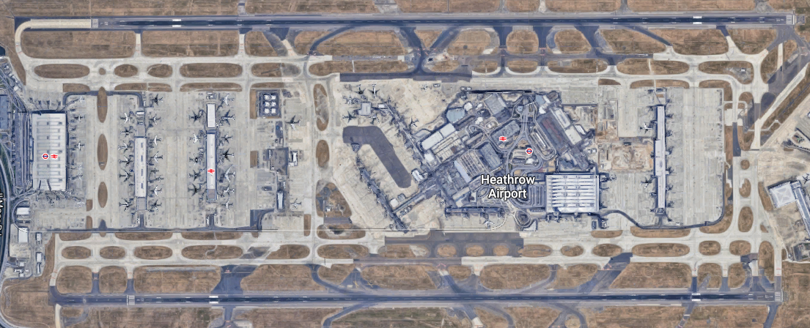
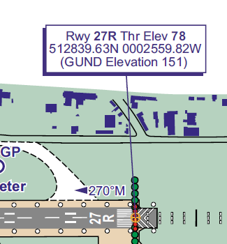

```{r setup, include = FALSE}
knitr::opts_chunk$set(
  collapse = TRUE,
  echo = TRUE,
  warning=FALSE,
  message=FALSE,
  comment = "#>",
  out.width = "220px",
  fig.align = 'center'
)

# library(png)
library(nvctr)
library(trrrj)
library(ggplot2)
library(stringr)
# library(mapview)
```

# Introduction

The aim of this vignette is to describes a way to identifying the runway an approaching aircraft
is landing on from flight trajectory data.
The solution [Example 11][ex11] in `nvctr` package is used as the basis for the implementation.
 


The arrivals to Londow Heathrow airport (EGLL), which has two parallel runways, on 2nd Aug 2017
between 08:00 and 09:00 have been selected for this use case.

**TODO**: check [runway alternation][rwy-alternation] and [2017 plan][rwy-alternation-2017]
and pick flights around runway alternation time tipically 15:00 local time so to spot
and better validate the technique.

**TODO**: get APDF runway data in order to see how well this algorithms matches reported
landing runways (which could have errors too...)

```{r egll-satellite,fig.cap="Satellite view of London Heathrow (EGLL) runways", out.width="100%",echo=FALSE}

```

[ex11]: <https://nvctr.ansperformance.eu/articles/position-calculations.html#example-11-cross-track-intersection> "Example 11 - nvctr package"
[rwy-alternation]: <https://www.heathrow.com/noise/heathrow-operations/runway-alternation> "Runway alternation - EGLL"
[rwy-alternation-2017]: <https://www.heathrow.com/file_source/HeathrowNoise/Static/Runway_Alternation_Programme_2017.pdf> "Runway alternation plan 2017 - EGLL"

# Input Data

## EGLL Runways

The [Runway](https://en.wikipedia.org/wiki/Runway), for this use case, can be simply
modelled by its ID/name and the 3D coordinates (longitude, latitude and elevation) of
its threshold.


As an exaple, the coordinates for Runway 27R are published in the
Aeronautical Information Pubblication (AIP) for EGLL^[
[NATS Aeronautilcal Information Service][egll-aip] publishes all aeronautical
information for EGLL [in the relevant AIP][egll-aip] ] and correspond
to the data as in the following Figure.

```{r egll-27r,fig.cap="Marker positioned at 027R runway's threshold in London Heathrow (EGLL)",fig.pos='hbt',fig.height=4, out.width="60%",echo=FALSE}

```

From the [EGLL AIP][egll-aip] we can then extract the following table for EGLL runways:

```{r egll-data, echo=FALSE}
data("egll_apt", package = "trrrj")

egll_arp <- egll_apt %>%
  dplyr::filter(type == "ARP")

egll_rwy <- egll_apt %>%
  dplyr::filter(type == "RWY") %>% 
  dplyr::mutate(id = stringr::word(name, -1)) %>% 
  dplyr::select(id, longitude, latitude, elevation)

knitr::kable(
  egll_rwy,
  col.names = c("ID",
                "Longitude [DD]", "Latitude [DD]",
                "Elevation [ft]"))
```


[nats-aip]: <http://www.nats-uk.ead-it.com/public/index.php%3Foption=com_content&task=blogcategory&id=1&Itemid=2.html> "Aeronautical Information Service - NATS"
[egll-aip]: <http://www.nats-uk.ead-it.com/public/index.php%3Foption=com_content&task=blogcategory&id=94&Itemid=143.html> "AIP - EGLL"


## Flight Trajectories Data Sets

The `egll_flights_fr24` and `egll_positions_fr24` data sets that come with the `trrrj` package
provide a subset of arrivals at EGLL that can be used as a realistic data sample for
the use case.


### Flight's Information Data, `egll_flights_fr24`

The first data set, `egll_flights_fr24`, provides flight information for each flight (`flight_id`)
such as 
callsign, aircraft ICAO 24-bit address, aerodrome of arrival ...
See `?egll_flights_fr24` for all the details.
The following table shows few rows of `egll_flights_fr24`:

```{r flight-info, echo=FALSE}
data("egll-flights-fr24", package = "trrrj")
# load(here::here("data", "egll-flights-fr24.rda"))
knitr::kable(egll_flights_fr24 %>% head(),
             caption = "Flights information for arrivals at London Heathrow (few rows.)")
```


### Flight's Positions Data, `egll_positions_fr24`

The second data set, `egll_positions_fr24`, provides position information for each flight (`flight_id`)
such as 
timestamp, latitude, longitude, altitude ...
See `?egll_positions_fr24` for all the details.
The following table shows few rows of `egll_positions_fr24`:


```{r position-info, echo=FALSE}
data("egll-positions-fr24")
# load(here::here("data", "egll-positions-fr24.rda"))
snip <- egll_positions_fr24 %>%
  dplyr::group_by(flight_id) %>% 
  dplyr::arrange(event_time) %>% 
  head()
knitr::kable(snip,
  caption = "timestamped (3D) position reports for arrivals at London Heathrow (few rows).")
```


The Figure below shows the sample arrival trajectories to EGLL.

```{r flights-2d,echo=FALSE,out.width = "75%"}
data("egll_rw_sf", package = "trrrj")
data("egll-positions-fr24", package = "trrrj")

egll_strips <- egll_rw_sf %>% 
  sf::st_transform(3857) %>%
  sf::st_buffer(dist = 25, endCapStyle="FLAT") %>%
  sf::st_transform(4326)

bbox <- c(xmin = -0.6, xmax = 0.2, ymin = 51.2, ymax = 51.6)

g_arr <- egll_positions_fr24 %>%
  dplyr::left_join(egll_flights_fr24, by = "flight_id") %>% 
  dplyr::group_by(flight_id) %>% 
  tidyr::nest() %>% 
  dplyr::slice(1:5) %>% 
  tidyr::unnest() %>% 
  dplyr::arrange(event_time) %>% 
  plot_flight_horizontal(bbox = bbox,
                         buffer = 2,
                         shape = NULL)

bbox <- sf::st_bbox(bbox, crs = sf::st_crs(4326))

g_arr + 
  geom_sf(data = egll_rw_sf) +
  ggplot2::coord_sf(xlim = c(bbox["xmin"], bbox["xmax"]),
                  ylim = c(bbox["ymin"], bbox["ymax"]),
                  expand = TRUE) +
  theme(legend.position = "none")
```


```{r plot-single, echo=FALSE,out.width = "75%", eval=FALSE}
data("egll-positions-fr24", package = "trrrj")
# Here is a single (spiky?) flight:
f <- egll_positions_fr24 %>%
  dplyr::left_join(egll_flights_fr24) %>% 
  dplyr::group_by(flight_id) %>% 
  tidyr::nest() %>% 
  dplyr::slice(5) %>% 
  tidyr::unnest() %>% 
  dplyr::arrange(event_time)


fff <- egll_positions_fr24 %>%
  dplyr::left_join(egll_flights_fr24)


fff <- fff %>% 
  dplyr::mutate(distance_arp = geosphere::distGeo(
    cbind(longitude, latitude),
    cbind(egll_arp$longitude, egll_arp$latitude))) %>% 
  dplyr::mutate(distance_09L27R = 0) %>% 
  dplyr::mutate(distance_09R27L = 0) %>% 
  dplyr::group_by(flight_id) %>% 
  dplyr::mutate(sequence_number = dplyr::row_number()) %>% 
  dplyr::ungroup()
  

# keep only last x NM to ARP
wef_nm <- 8
wef <- fff %>% 
  dplyr::filter(distance_09L27R < wef_nm * 1852) %>%
  dplyr::arrange(dplyr::desc(distance_arp), sequence_number) %>%
  dplyr::filter(dplyr::row_number() == 1) %>%
  dplyr::select(flight_id, sequence_number)

# keep only up to x NM to the middle of the runway
# TODO
# till_nm <- 


fff <- fff %>% 
  dplyr::left_join(wef, by = "flight_id", suffix = c("", "_min")) %>% 
  dplyr::filter(sequence_number >= sequence_number_min) %>% 
  dplyr::select(-sequence_number_min)

fids <- egll_flights %>% dplyr::pull(flight_id)

buf <- 3
# n <- 15
# fid <- fids[n]

fid <- fff %>%
  filter(callsign == "BAW347") %>%
  filter(row_number() == 1) %>%
  pull(flight_id)

f <- fff %>% 
  filter(flight_id == fid)

f %>%
  plot_flight_2d(type = "toner-lite", buffer = buf) +
  theme(legend.position = "none")


# 
# f %>% 
#   sf::st_as_sf(coords = c("longitude", "latitude"), crs = 4326) %>% 
#   mapview()

```

